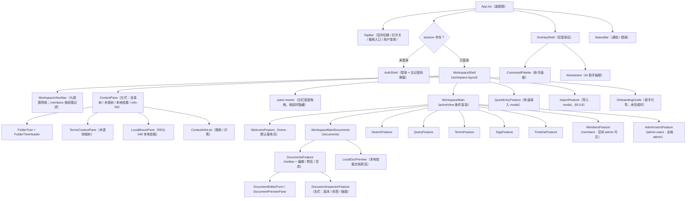

# DIAG-FE-COMP-01 · 前端组件树（App 装配 → Shell → Feature）

> **生成式镜像**（`scripts/extract-diagrams.mjs` 产物，不手改）。
> 唯一权威源：`docs/design/frontend-interaction.md`（本图所在块）。阶段：详细设计；类型：组件树（前端）；追溯：REQ-011 / COMP-001 · CQ-P1-008；渲染：GitHub 原生。

