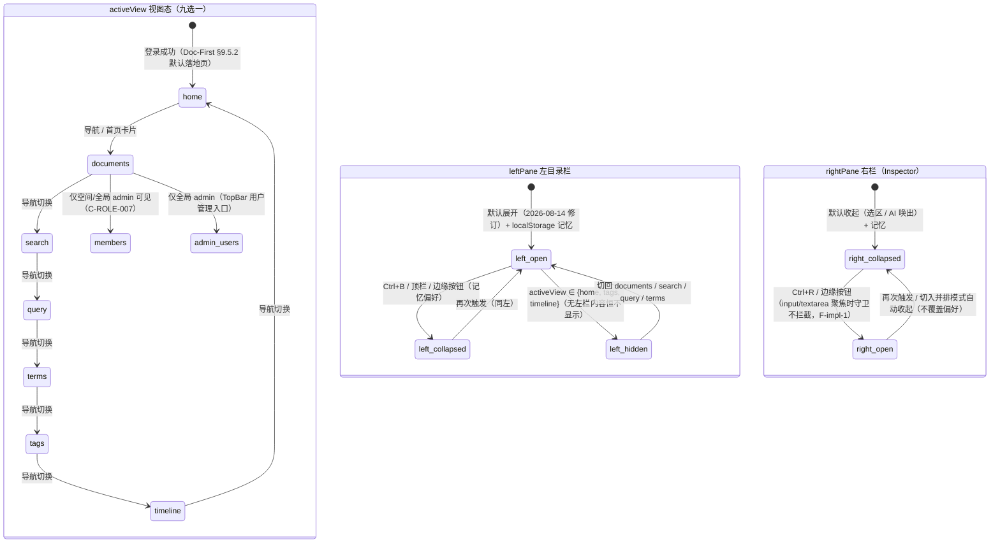

# DIAG-FE-STATE-01 · 工作台视图与栏布局状态机

> **生成式镜像**（`scripts/extract-diagrams.mjs` 产物，不手改）。
> 唯一权威源：`docs/design/frontend-interaction.md`（本图所在块）。阶段：详细设计；类型：状态图（前端）；追溯：REQ-011 · Doc-First §9.5；渲染：GitHub 原生。

