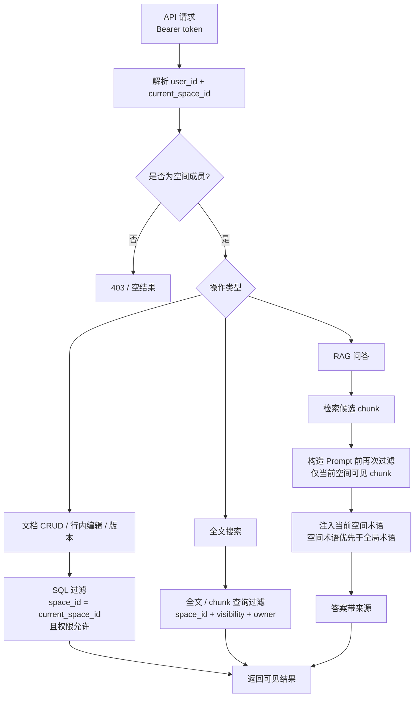

# DIAG-FLOW-002 · Flow-002 统一过滤（概要流程）

> **生成式镜像**（`scripts/extract-diagrams.mjs` 产物，不手改）。
> 唯一权威源：`docs/04-architecture.md`（本图所在块）。阶段：概要设计；类型：流程图；追溯：API-004..010 / TC-P1-003..008；渲染：GitHub 原生。

```mermaid
flowchart TB
  req[API 请求<br/>Bearer token] --> ctx[解析 user_id + current_space_id]
  ctx --> membership{是否为空间成员?}
  membership -- 否 --> deny[403 / 空结果]
  membership -- 是 --> op{操作类型}

  op --> doc[文档 CRUD / 行内编辑 / 版本]
  op --> search[全文搜索]
  op --> rag[RAG 问答]

  doc --> docFilter[SQL 过滤<br/>space_id = current_space_id<br/>且权限允许]
  search --> searchFilter[全文 / chunk 查询过滤<br/>space_id + visibility + owner]
  rag --> retrieve[检索候选 chunk]
  retrieve --> ragFilter[构造 Prompt 前再次过滤<br/>仅当前空间可见 chunk]
  ragFilter --> term[注入当前空间术语<br/>空间术语优先于全局术语]
  term --> answer[答案带来源]

  docFilter --> result[返回可见结果]
  searchFilter --> result
  answer --> result
```
