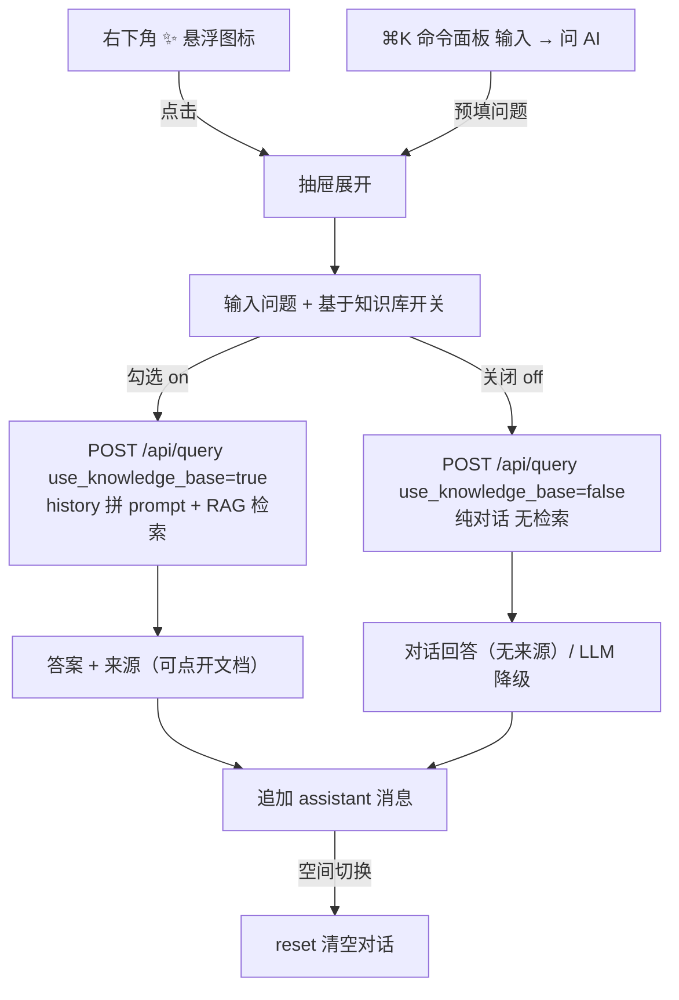

# DIAG-FLOW-ASSIST · AI 助手多轮对话交互流

> **生成式镜像**（`scripts/extract-diagrams.mjs` 产物，不手改）。
> 唯一权威源：`docs/design/ai-assistant.md`（本图所在块）。阶段：详细设计；类型：流程图；追溯：Flow-D-ASSIST-01；渲染：GitHub 原生。

```mermaid
flowchart TD
  A[右下角 ✨ 悬浮图标] -->|点击| B[抽屉展开]
  C[⌘K 命令面板 输入 → 问 AI] -->|预填问题| B
  B --> D[输入问题 + 基于知识库开关]
  D -->|勾选 on| E[POST /api/query use_knowledge_base=true<br/>history 拼 prompt + RAG 检索]
  D -->|关闭 off| F[POST /api/query use_knowledge_base=false<br/>纯对话 无检索]
  E --> G[答案 + 来源（可点开文档）]
  F --> H[对话回答（无来源）/ LLM 降级]
  G --> I[追加 assistant 消息]
  H --> I
  I -->|空间切换| J[reset 清空对话]
```
