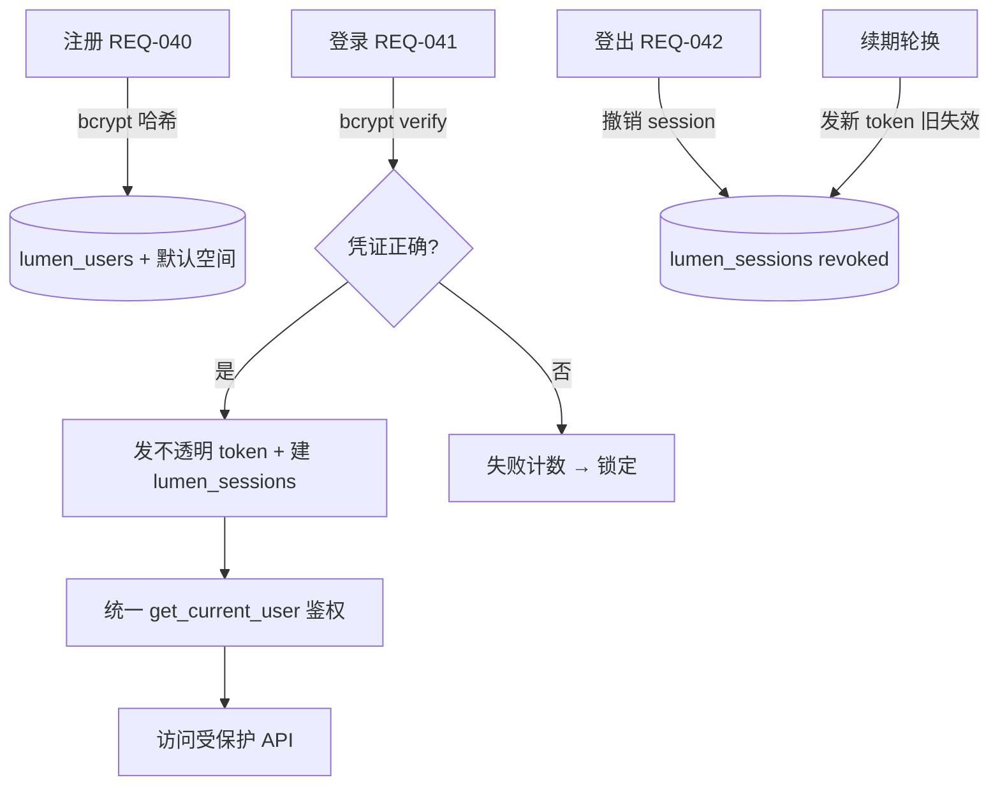

# DIAG-FLOW-AUTH · 认证流程（注册 / 登录 / 登出）

> **生成式镜像**（`scripts/extract-diagrams.mjs` 产物，不手改）。
> 唯一权威源：`docs/design/accounts-auth.md`（本图所在块）。阶段：详细设计；类型：流程图；追溯：REQ-040..042；渲染：GitHub 原生。

```mermaid
flowchart TD
  R[注册 REQ-040] -->|bcrypt 哈希| DB1[(lumen_users + 默认空间)]
  L[登录 REQ-041] -->|bcrypt verify| V{凭证正确?}
  V -->|是| S[发不透明 token + 建 lumen_sessions]
  V -->|否| F[失败计数 → 锁定]
  S --> U[统一 get_current_user 鉴权]
  U --> A[访问受保护 API]
  LO[登出 REQ-042] -->|撤销 session| DB2[(lumen_sessions revoked)]
  RF[续期轮换] -->|发新 token 旧失效| DB2
```
