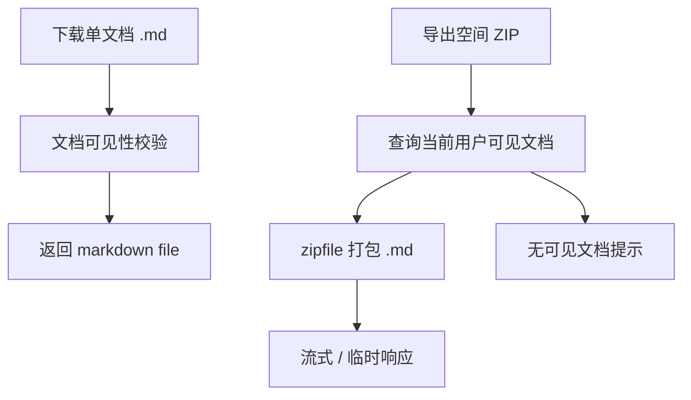

# DIAG-FLOW-EXPORT-MDZIP · Flow-007 .md / ZIP 导出流程

> **生成式镜像**（`scripts/extract-diagrams.mjs` 产物，不手改）。
> 唯一权威源：`docs/design/export-delivery.md`（本图所在块）。阶段：详细设计；类型：流程图；追溯：REQ-038；渲染：GitHub 原生。

```mermaid
flowchart TB
  doc[下载单文档 .md] --> auth1[文档可见性校验]
  auth1 --> md[返回 markdown file]
  space[导出空间 ZIP] --> query[查询当前用户可见文档]
  query --> pack[zipfile 打包 .md]
  pack --> stream[流式 / 临时响应]
  query --> empty[无可见文档提示]
```
