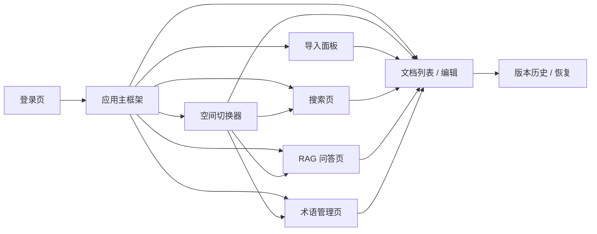

# DIAG-FLOW-FE-IA · P1 页面信息架构

> **生成式镜像**（`scripts/extract-diagrams.mjs` 产物，不手改）。
> 唯一权威源：`docs/design/frontend-interaction.md`（本图所在块）。阶段：详细设计；类型：流程图（前端）；追溯：REQ-011 页面清单；渲染：GitHub 原生。

```mermaid
flowchart LR
  login[登录页] --> shell[应用主框架]
  shell --> space[空间切换器]
  shell --> docs[文档列表 / 编辑]
  shell --> import[导入面板]
  shell --> search[搜索页]
  shell --> query[RAG 问答页]
  shell --> terms[术语管理页]

  space --> docs
  space --> search
  space --> query
  space --> terms

  docs --> versions[版本历史 / 恢复]
  import --> docs
  search --> docs
  query --> docs
  terms --> docs
```
