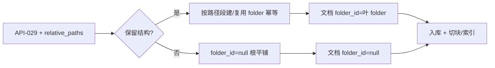

# DIAG-FLOW-FOLDER-IMPORT · 导入保留目录结构流程

> **生成式镜像**（`scripts/extract-diagrams.mjs` 产物，不手改）。
> 唯一权威源：`docs/design/folder-tree.md`（本图所在块）。阶段：详细设计；类型：流程图；追溯：Flow-D-012；渲染：GitHub 原生。

```mermaid
flowchart LR
  import[API-029 + relative_paths] --> parse{保留结构?}
  parse -->|是| build[按路径段建/复用 folder 幂等]
  parse -->|否| flat[folder_id=null 根平铺]
  build --> leaf[文档 folder_id=叶 folder]
  flat --> doc[文档 folder_id=null]
  leaf --> done[入库 + 切块/索引]
  doc --> done
```
