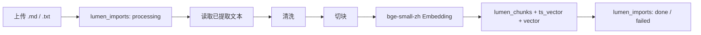

# DIAG-FLOW-INGEST-SINGLE · Flow-D-001 单文件导入流程

> **生成式镜像**（`scripts/extract-diagrams.mjs` 产物，不手改）。
> 唯一权威源：`docs/design/ingestion.md`（本图所在块）。阶段：详细设计；类型：流程图；追溯：REQ-009；渲染：GitHub 原生。

```mermaid
flowchart LR
  upload[上传 .md / .txt] --> imports[lumen_imports: processing]
  imports --> extract[读取已提取文本]
  extract --> clean[清洗]
  clean --> chunk[切块]
  chunk --> embedding[bge-small-zh Embedding]
  embedding --> chunks[lumen_chunks + ts_vector + vector]
  chunks --> done[lumen_imports: done / failed]
```
