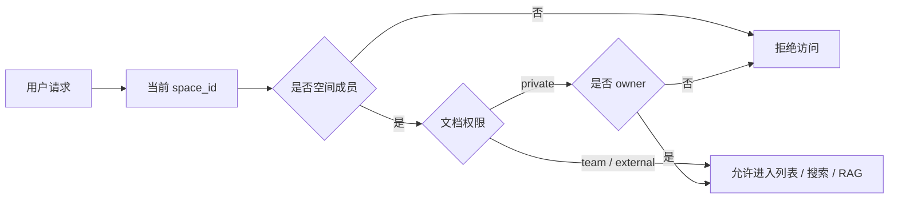

# DIAG-FLOW-PERM-FILTER · 权限过滤决策流

> **生成式镜像**（`scripts/extract-diagrams.mjs` 产物，不手改）。
> 唯一权威源：`docs/design/permissions.md`（本图所在块）。阶段：详细设计；类型：流程图；追溯：Flow-D-002；渲染：GitHub 原生。

```mermaid
flowchart LR
  request[用户请求] --> space[当前 space_id]
  space --> membership{是否空间成员}
  membership -- 否 --> deny[拒绝访问]
  membership -- 是 --> permission{文档权限}
  permission -- team / external --> allow[允许进入列表 / 搜索 / RAG]
  permission -- private --> owner{是否 owner}
  owner -- 是 --> allow
  owner -- 否 --> deny
```
