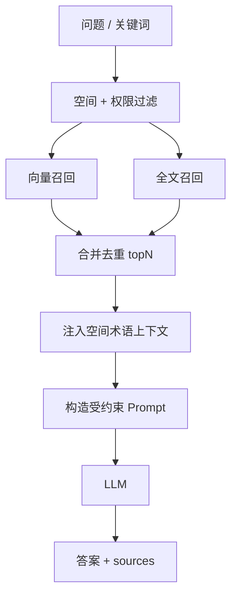

# DIAG-FLOW-RAG · RAG 检索问答流程

> **生成式镜像**（`scripts/extract-diagrams.mjs` 产物，不手改）。
> 唯一权威源：`docs/design/rag-retrieval.md`（本图所在块）。阶段：详细设计；类型：流程图；追溯：Flow-D-004；渲染：GitHub 原生。

```mermaid
flowchart TB
  question[问题 / 关键词] --> permission[空间 + 权限过滤]
  permission --> vector[向量召回]
  permission --> keyword[全文召回]
  vector --> merge[合并去重 topN]
  keyword --> merge
  merge --> terms[注入空间术语上下文]
  terms --> prompt[构造受约束 Prompt]
  prompt --> llm[LLM]
  llm --> answer[答案 + sources]
```
