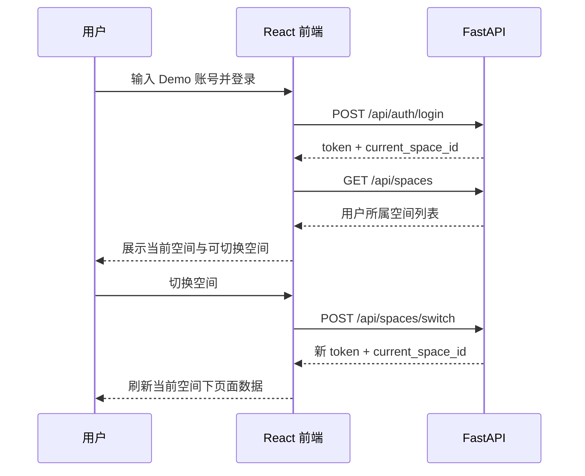

# DIAG-SEQ-FE-UF001 · UF-001 登录与空间切换（前端时序）

> **生成式镜像**（`scripts/extract-diagrams.mjs` 产物，不手改）。
> 唯一权威源：`docs/design/frontend-interaction.md`（本图所在块）。阶段：详细设计；类型：顺序图（前端）；追溯：UF-001；渲染：GitHub 原生。

```mermaid
sequenceDiagram
  participant User as 用户
  participant UI as React 前端
  participant API as FastAPI

  User->>UI: 输入 Demo 账号并登录
  UI->>API: POST /api/auth/login
  API-->>UI: token + current_space_id
  UI->>API: GET /api/spaces
  API-->>UI: 用户所属空间列表
  UI-->>User: 展示当前空间与可切换空间
  User->>UI: 切换空间
  UI->>API: POST /api/spaces/switch
  API-->>UI: 新 token + current_space_id
  UI-->>User: 刷新当前空间下页面数据
```
