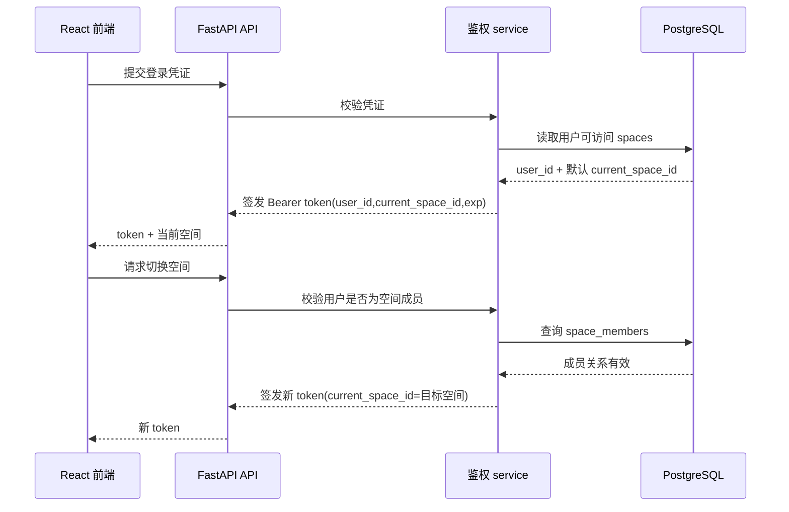

# DIAG-SEQ-FLOW001 · Flow-001 登录与空间切换（概要流程）

> **生成式镜像**（`scripts/extract-diagrams.mjs` 产物，不手改）。
> 唯一权威源：`docs/04-architecture.md`（本图所在块）。阶段：概要设计；类型：顺序图（流程）；追溯：API-001..003 / TC-P1-001/002；渲染：GitHub 原生。

