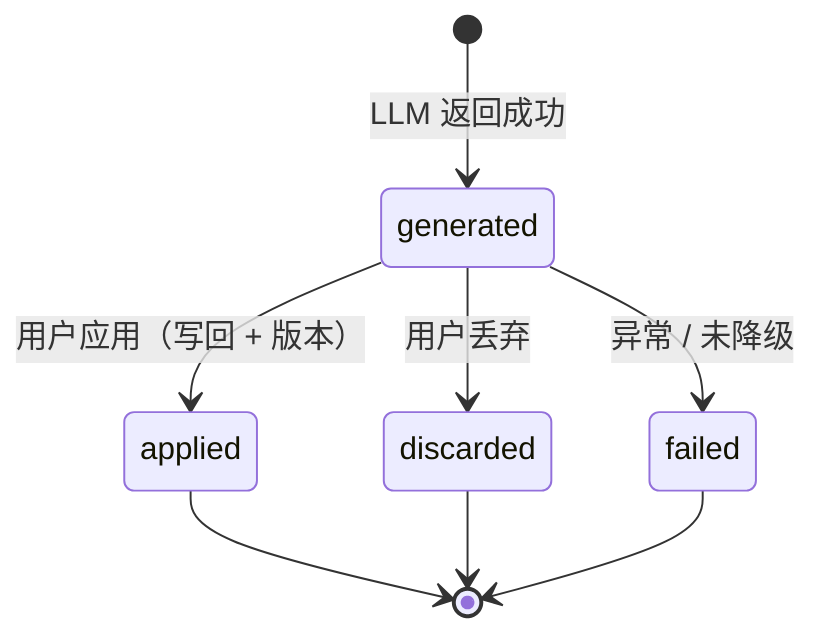

# DIAG-STATE-DRAFT-01 · AI 草稿生命周期状态机

> **生成式镜像**（`scripts/extract-diagrams.mjs` 产物，不手改）。
> 唯一权威源：`docs/design/ai-polish.md`（本图所在块）。阶段：详细设计；类型：状态图；追溯：REQ-014；渲染：GitHub 原生。

```mermaid
stateDiagram-v2
  [*] --> generated: LLM 返回成功
  generated --> applied: 用户应用（写回 + 版本）
  generated --> discarded: 用户丢弃
  generated --> failed: 异常 / 未降级
  applied --> [*]
  discarded --> [*]
  failed --> [*]
```
