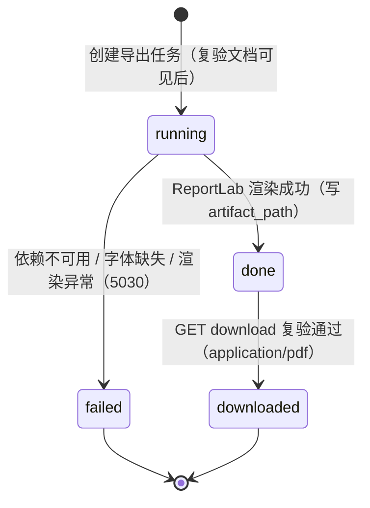

# DIAG-STATE-EXPORT-01 · PDF 导出任务状态机

> **生成式镜像**（`scripts/extract-diagrams.mjs` 产物，不手改）。
> 唯一权威源：`docs/design/export-delivery.md`（本图所在块）。阶段：详细设计；类型：状态图；追溯：REQ-027 · EX-008；渲染：GitHub 原生。

```mermaid
stateDiagram-v2
  [*] --> running : 创建导出任务（复验文档可见后）
  running --> done : ReportLab 渲染成功（写 artifact_path）
  running --> failed : 依赖不可用 / 字体缺失 / 渲染异常（5030）
  done --> downloaded : GET download 复验通过（application/pdf）
  failed --> [*]
  downloaded --> [*]
```
