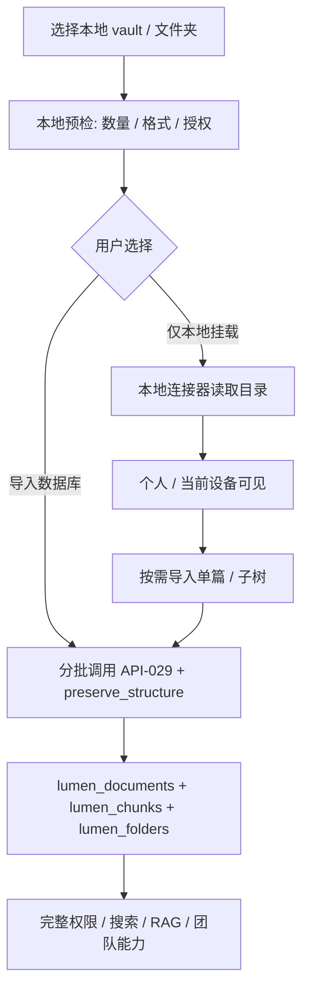

# DIAG-STATE-IMPORT-01 · 导入任务状态机（单文件任务态）

> **生成式镜像**（`scripts/extract-diagrams.mjs` 产物，不手改）。
> 唯一权威源：`docs/design/ingestion.md`（本图所在块）。阶段：详细设计；类型：状态图；追溯：REQ-009/037 · EX-003/006；渲染：GitHub 原生。

```mermaid
flowchart TB
  pick[选择本地 vault / 文件夹] --> preflight[本地预检: 数量 / 格式 / 授权]
  preflight --> mode{用户选择}
  mode -->|导入数据库| importdb[分批调用 API-029 + preserve_structure]
  importdb --> dbdocs[lumen_documents + lumen_chunks + lumen_folders]
  dbdocs --> full[完整权限 / 搜索 / RAG / 团队能力]
  mode -->|仅本地挂载| local[本地连接器读取目录]
  local --> personal[个人 / 当前设备可见]
  personal --> promote[按需导入单篇 / 子树]
  promote --> importdb
```
