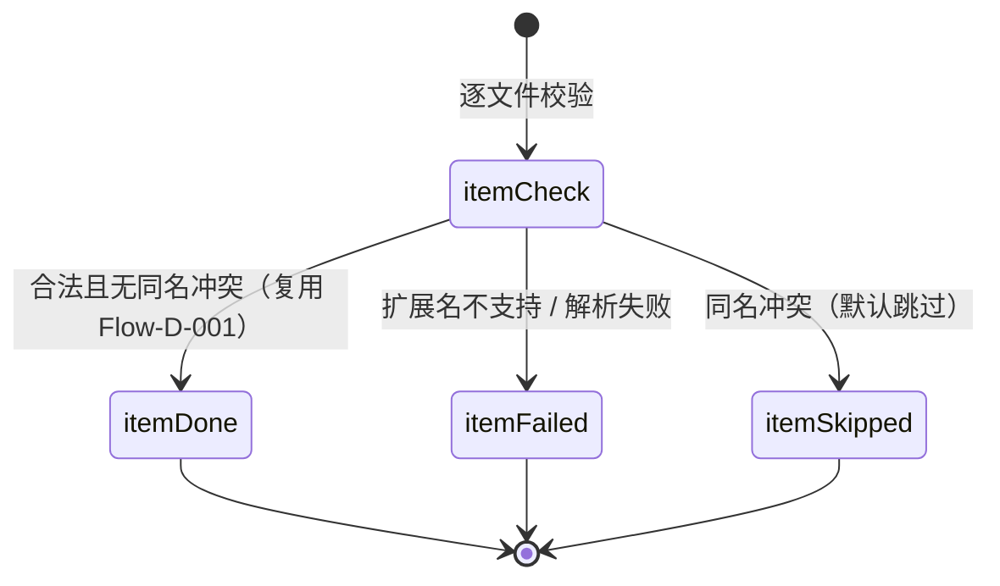

# DIAG-STATE-IMPORT-01b · 批量导入逐文件结果态（响应级）

> **生成式镜像**（`scripts/extract-diagrams.mjs` 产物，不手改）。
> 唯一权威源：`docs/design/ingestion.md`（本图所在块）。阶段：详细设计；类型：状态图；追溯：Flow-006 items[]；渲染：GitHub 原生。

```mermaid
stateDiagram-v2
  [*] --> itemCheck : 逐文件校验
  itemCheck --> itemDone : 合法且无同名冲突（复用 Flow-D-001）
  itemCheck --> itemFailed : 扩展名不支持 / 解析失败
  itemCheck --> itemSkipped : 同名冲突（默认跳过）
  itemDone --> [*]
  itemFailed --> [*]
  itemSkipped --> [*]
```
