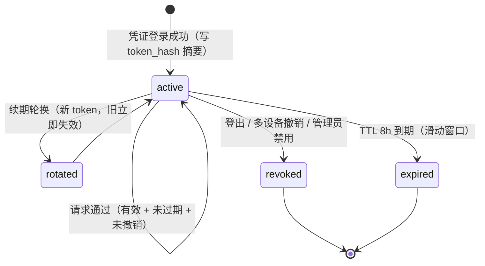

# DIAG-STATE-SESSION-01 · 会话生命周期状态机

> **生成式镜像**（`scripts/extract-diagrams.mjs` 产物，不手改）。
> 唯一权威源：`docs/design/accounts-auth.md`（本图所在块）。阶段：详细设计；类型：状态图；追溯：REQ-041/042；渲染：GitHub 原生。

```mermaid
stateDiagram-v2
  [*] --> active : 凭证登录成功（写 token_hash 摘要）
  active --> active : 请求通过（有效 + 未过期 + 未撤销）
  active --> rotated : 续期轮换（新 token，旧立即失效）
  active --> revoked : 登出 / 多设备撤销 / 管理员禁用
  active --> expired : TTL 8h 到期（滑动窗口）
  rotated --> active
  revoked --> [*]
  expired --> [*]
```
