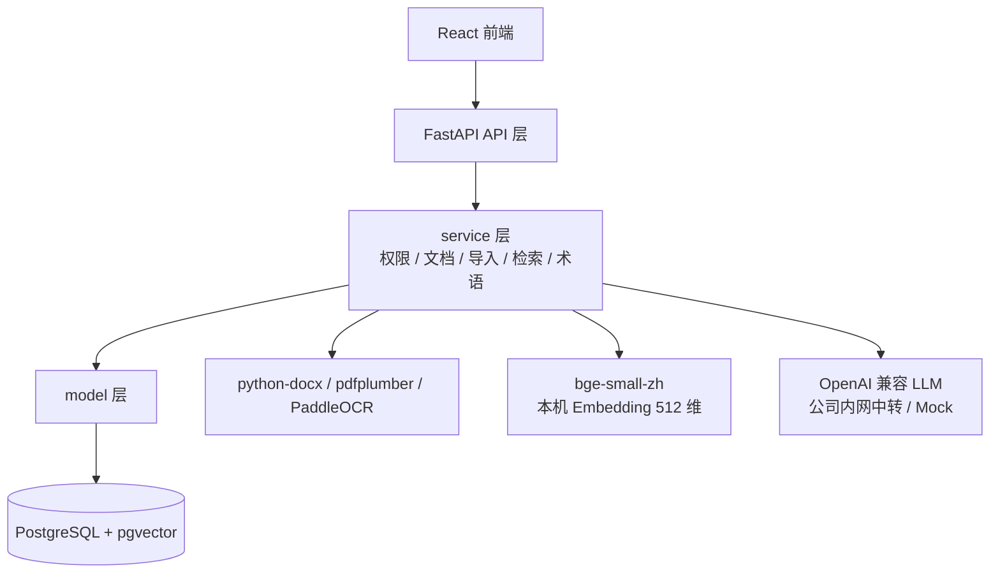

# DIAG-TECH-STACK-01 · 技术栈分层图

> **生成式镜像**（`scripts/extract-diagrams.mjs` 产物，不手改）。
> 唯一权威源：`docs/05-tech-spec.md`（本图所在块）。阶段：实现；类型：分层图；追溯：05 §1 COMP；渲染：GitHub 原生。

```mermaid
flowchart TB
  frontend[React 前端] --> api[FastAPI API 层]
  api --> service[service 层<br/>权限 / 文档 / 导入 / 检索 / 术语]
  service --> model[model 层]
  model --> postgres[(PostgreSQL + pgvector)]
  service --> parser[python-docx / pdfplumber / PaddleOCR]
  service --> embedding[bge-small-zh<br/>本机 Embedding 512 维]
  service --> llm[OpenAI 兼容 LLM<br/>公司内网中转 / Mock]
```
