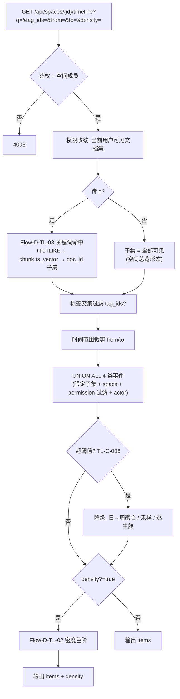

# DIAG-TL-FLOW-01 · 主题时间线装配流程

> **生成式镜像**（`scripts/extract-diagrams.mjs` 产物，不手改）。
> 唯一权威源：`docs/design/timeline.md`（本图所在块）。阶段：详细设计；类型：流程图；追溯：REQ-013a/024；渲染：GitHub 原生。

```mermaid
flowchart TD
  req["GET /api/spaces/{id}/timeline?q=&tag_ids=&from=&to=&density="] --> auth{"鉴权 + 空间成员"}
  auth -->|否| e4003["4003"]
  auth -->|是| perm["权限收敛: 当前用户可见文档集"]
  perm --> kw{"传 q?"}
  kw -->|是| match["Flow-D-TL-03 关键词命中<br/>title ILIKE + chunk.ts_vector → doc_id 子集"]
  kw -->|否| all["子集 = 全部可见<br/>(空间总览形态)"]
  match --> tagf["标签交集过滤 tag_ids?"]
  all --> tagf
  tagf --> win["时间范围裁剪 from/to"]
  win --> union["UNION ALL 4 类事件<br/>(限定子集 + space + permission 过滤 + actor)"]
  union --> big{"超阈值? TL-C-006"}
  big -->|是| deg["降级: 日→周聚合 / 采样 / 逃生舱"]
  big -->|否| dense{"density?=true"}
  deg --> dense
  dense -->|是| calc["Flow-D-TL-02 密度色阶"]
  dense -->|否| out["输出 items"]
  calc --> out2["输出 items + density"]
```
