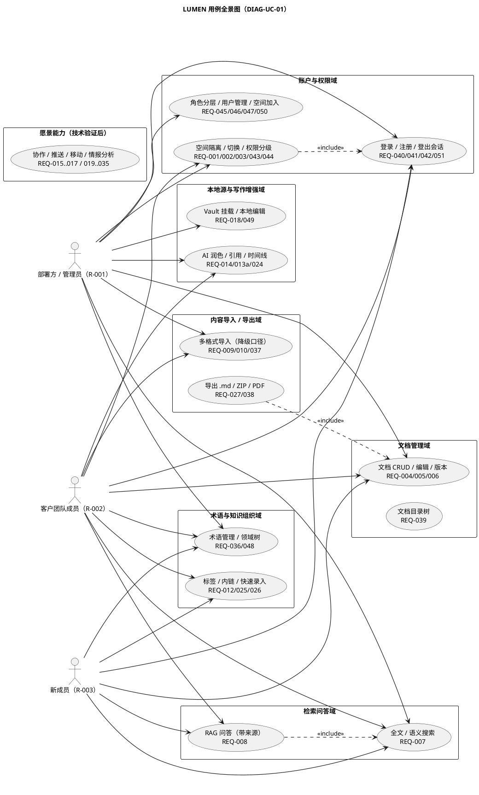

# DIAG-UC-01 · 用例全景图（域入口视图）

> **生成式镜像**（`scripts/extract-diagrams.mjs` 产物，不手改）。
> 唯一权威源：`docs/00-scenario.md`（本图所在块）。阶段：需求分析；类型：用例图；追溯：全量 REQ（01 §6 / 00 §3.3）；渲染：plantuml（需本机预览）。

```plantuml
@startuml
left to right direction
title LUMEN 用例全景图（DIAG-UC-01）
skinparam defaultFontName "Microsoft YaHei"
skinparam nodeFontSize 12
skinparam ArrowThickness 1.2

actor "部署方 / 管理员（R-001）" as R1
actor "客户团队成员（R-002）" as R2
actor "新成员（R-003）" as R3

rectangle "账户与权限域" {
  usecase "登录 / 注册 / 登出会话\nREQ-040/041/042/051" as A1
  usecase "空间隔离 / 切换 / 权限分级\nREQ-001/002/003/043/044" as A2
  usecase "角色分层 / 用户管理 / 空间加入\nREQ-045/046/047/050" as A3
}
rectangle "文档管理域" {
  usecase "文档 CRUD / 编辑 / 版本\nREQ-004/005/006" as D1
  usecase "文档目录树\nREQ-039" as D2
}
rectangle "检索问答域" {
  usecase "全文 / 语义搜索\nREQ-007" as RQ1
  usecase "RAG 问答（带来源）\nREQ-008" as RQ2
}
rectangle "内容导入 / 导出域" {
  usecase "多格式导入（降级口径）\nREQ-009/010/037" as I1
  usecase "导出 .md / ZIP / PDF\nREQ-027/038" as I2
}
rectangle "术语与知识组织域" {
  usecase "术语管理 / 领域树\nREQ-036/048" as T1
  usecase "标签 / 内链 / 快速录入\nREQ-012/025/026" as O1
}
rectangle "本地源与写作增强域" {
  usecase "Vault 挂载 / 本地编辑\nREQ-018/049" as V1
  usecase "AI 润色 / 引用 / 时间线\nREQ-014/013a/024" as W1
}
rectangle "愿景能力（技术验证后）" {
  usecase "协作 / 推送 / 移动 / 情报分析\nREQ-015..017 / 019..035" as VN1
}

' 参与者关联（每域入口；完整 actor → 用例映射见 01 §6）
R1 --> A1
R1 --> A2
R1 --> A3
R1 --> D1
R1 --> RQ1
R1 --> I1
R1 --> T1
R1 --> V1
R1 --> W1
R2 --> A1
R2 --> A2
R2 --> D1
R2 --> RQ1
R2 --> RQ2
R2 --> I1
R2 --> T1
R2 --> O1
R2 --> W1
R3 --> A1
R3 --> D1
R3 --> RQ1
R3 --> RQ2
R3 --> T1
R3 --> O1

' 关系（<<include>>）
RQ2 ..> RQ1 : <<include>>
A2 ..> A1 : <<include>>
I2 ..> D1 : <<include>>
@enduml
```
